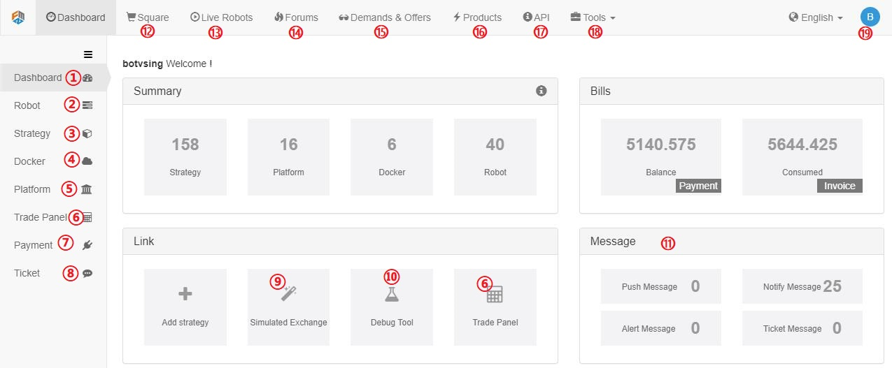
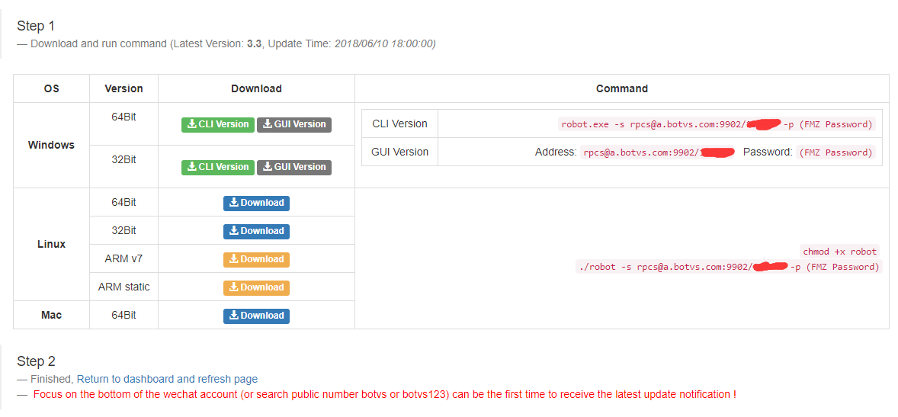
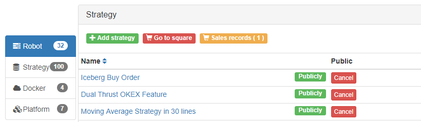
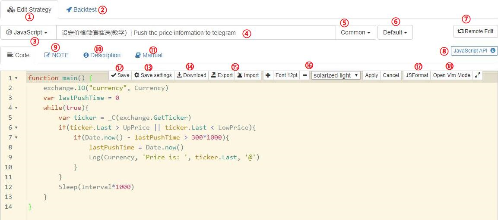
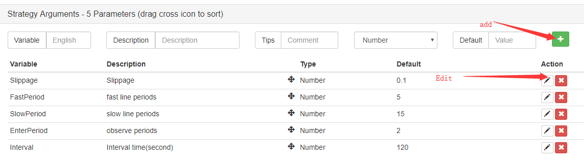
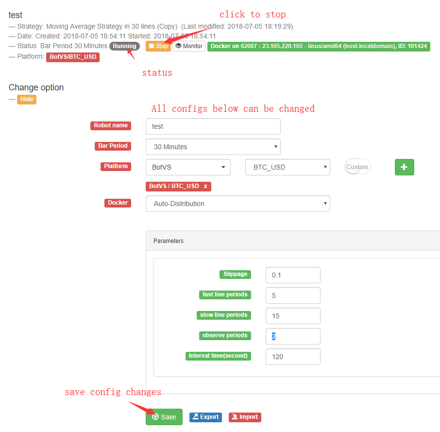

1.1 Getting Started
=======================

What if I don’t have any program developing or financial skills? Can I still make quantitative trading or run a robot on this platform?

Absolutely, our platform has a complete tutorial for beginners. Only need studying a couple of days, you are ready to code for your own robot.

**What can FMZ do for me?**

You can learn how to write your bots(strategies) from our strategies' square which contains lots of open source code, share your strategy’s code with others,
ask for professional help any time, run your strategy on any exchanges, contorl your bot on website with computer or cellphone, sell your strategies if you want,
communicate with many other auto-trading lovers in our group. In a word, FMZ is a perfect platform for those who want do automated trading.

**Which Cryptocurrency exchanges does FMZ support?**

FMZ supports almost all exchanges that are popular, such as Binance, Bitfinex, Bitstamp, OKEX, Huobi, Poloniex,etc. you can also trade futures on OKEX and BitMEX.
Check a full support list on :ref:`exchanges list`.
You only need to write one strategy and run it on all exchanges without any changes.

**What kinds of programming languages can I use to write my strategies?**

FMZ supports `JavaScript`, `Python`, `C++` (JavaScript and Python are recommended) for coding your strategies.  Benefiting from the completed languages supporting(not a custom language 
only can be used for one platform), you can improve your programming skills as well as learn to write strategies.

**What is the docker?**

The docker is a program that runs on your own Internet Server, which in charge of the data request, data reception, network link, Log review etc. 
You can treat it like your strategy’s executor. Even if the FMZ server offline (breakdown, etc.), 
it will have no influence on your robot that is running. 
The Manager can run on variety of operating system. 
Such as `Windows`, `Linux`, `Mac OS`, `Android`, `Raspbian`, etc.

**What does "FMZ" mean?**

"FMZ" doesn’t have a particular meanning in English.

1.2	The Backtest System
=======================

**What is backtest system? What it uses for?**

When you completed a quantitative strategy, how do you know that the logic, amount and direction of profit of this strategy goes? Does it work? Apparently, we wouldn’t use the real money to test our strategies on the real market. But we could use the historical data to test it, see how it works out on the time, profit, and asset management in the past. It is winning or losing?		How to use the Backtest System?

**Does the number from the backtest system accurate? The results can be trusted?**

FMZ divides the backtest system into real market level and simulation level. 
The real market level contains the whole completed historical data back testing. 

The simulation level contains the k-lines data at regular intervals. 
Both level are based on the real market historical data. Only the real market level is more accurate and the results are more reliable.

**The simulation level Backtest System explanation.**

Notice that backtesting is the strategy only preform in the past. Historical data doesn’t represent the future. History may replay, it also may lead to the black swan. Please treat the backtest results reasonable and objectively.

1.3	FMZ Instruction Manual
=======================

If you are new to trading, you need to understand a few basic concepts:

KEY-WORD: "Futures", "Spot", "Stock", "Position", "Long", "Short", "Balance", "Margin Call", "Hedge", 
"K Line", "MACD", "Ask / Bid".

1.3.1 A quick look of the main page
>>>>>>>>>>>>>>>>>>

After learning the most basic concepts, let’s start using FMZ to explore the quantitative world. 
(Building your own quantitative trading system is a very large project, you need to have considerable computer knowledge and skills, fortunately, FMZ has done this for you!)

Register your FMZ account,Log in to https://www.fmz.com.

.. image:: images/main_page.png

First time to log in the website, it looks like this:

1.3.2 Deploy the docker
>>>>>>>>>>>>>>>>>>>>>>>>>>>>>>>>>>>

First of all, FMZ's framework is very advanced, 
the user's robot program (that is, the automated trading program) is running on the user's own computer (of course, it can also be run on the cloud server),
So, it's very safe (don't need worry about the FMZ website breakdown etc.), the user has direct control over the program. 

Docker is a program that run your robots and communicate with FMZ website. You need to run a Docker first before start a real market robot.

.. note::

    It is highly recommended to use the cloud server for runing program stably, such as Amazon or Google Cloud Server. 

In the Dashboard page--``Add docker`` button, you can link to the download page https://www.fmz.com/m/add-node.

Here are steps to deploy the dockr in a Linux server(centOS 6):

- Buy a cloud server (VPS) from Amazon or Google, the lowest and cheapest configuration is enough. you may often has a free try for a long time.
- Login your server, fellow the instruction from your server provider or Google.
- Chose the docker that statisty your system version, most of the time, it is 64Bit.
- For ``centos``, run ``wget 'http://q.fmz.net/dist/robot_linux_amd64.tar.gz'``, command not found? install first ``yum install wget -y``.
- Run ``tar -xzvf robot_linux_amd64.tar.gz`` to unzip.
- Run ``./robot -s rpcs@node.fmz.com:9902/xxxxxx -p yourFMZpassword``,
  you should see something like ``2018/07/05 05:04:10 Login OK, SID: 62086, PID: 7226, Name: host.localdomain``, which means everything is worked. 
- ``rpcs@node.fmz.com:9902/xxxxxx`` is unique to every users, find your own on https://www.fmz.com/m/add-node.
- Now the docker isn't run in the background, if you close the SHH client, the docker will stop.
- Press ``ctrl + C`` to stop the docker.
- Run ``nohup ./robot -s rpcs@node.fmz.com:9902/xxxxxx -p yourFMZpassword &`` to run in the background. this step can also be done by ``Screen`` command.
- Check on https://www.fmz.com/m/dashboard, if everything is OK , you can find the docker deployed.

Steps to update the docker:

.. note::

    If you want to keep the old docker, one server can run many dockers, just create a new folder and repeate the deploy steps.

- Stop all robots that run on the docker.
- Delete the docker from FMZ website. the docker will stop on your server too(don't have to, you can run two dockers on one server, just create a new folder)
- Run ``rm -rf robot_linux_amd64.tar.gz`` in your dokcer files to delete the old docker.
- Run ``wget http://q.fmz.net/dist/robot_linux_amd64.tar.gz`` to download the lastest docker.
- Repeate the steps above.
- Change robot's config to use the new docker, restart robots.

.. image:: images/docker_dispaly.png

.. note::

    One docker can run many robots, however, you can deploy more than one dockers on different server for speed or request-rate-limit consideration. 
    the docker can be specified or auto-distributed when start a robot.

.. warning::

    There are two public dockers for testing. don't use them to run your robot on real market.

.. _add exchange:

1.3.3 Add exchanges
>>>>>>>>>>>>>>>>>>>>>>

Add your exchanges at this page: https://www.fmz.com/m/add-platform.

Now support:

.. sourcecode:: http

    Binance, Bitfinex, Huobi(huobipro), OKEX, Futures_OKCoin(OKEX), Futures_BitMEX, Poloniex, Bitstamp, 
    BotVS(FMZ Simulation Exchange),AEX, BigONE, BitFlyer, Bithumb, Bitpie, Bittrex, CoinEx, CoinPlus,
    Coincheck, Coinone, Futures_CTP, Futures_Deribit, Futures_Esunny, GateIO, HitBTC, KEX, Korbit, 
    Kraken, LiveCoin, OKCoin_EN, Quoine, WEX, ZB, Zaif.

``Access Key`` and ``Secret Key`` is needed, you should apply on your exchange first.

.. image:: images/add_platform.png

Once the exchange is added, you can find it on Dashboard https://www.fmz.com/m/dashboard.

.. image:: images/platform_list.png

.. note::

    New exchange supported is keep being added. you need to update the lastest docker to support new exchange.

1.3.4 Write or copy a strategy
>>>>>>>>>>>>>>>>>>>>>>

.. note::

    There are lots of details this docs doesn't cover, you can explore by yourself, most of them are simple and clear.
    You can always post on our forum if you have any question.

Write your own strategy by clicking ``Add Strategy``.

You can choose different code languages and backtesting

For beginners, copy this strategy to begain: https://www.fmz.com/strategy/103070, which can be found on https://www.fmz.com/square.

Click ``Copy and backtest``:

.. image:: images/copy.png

Click ``Creat``:

.. image:: images/create.png

Now your can find this strategy on your dashboard strategies list. https://www.fmz.com/m/dashboard

Edit your code here, don't forget to save your code:

Change and add global variables here:

1.3.5 Backtest your strategy
>>>>>>>>>>>>>>>>>>>>>>

Click Stragegy name to strategy page.

.. image:: images/go_to_strategy.png

Go to backtest page:

.. image:: images/backtest.png

Add exchange and config your strategy:

.. image:: images/backtest_config.png

Click ``Start Backtest`` to start.

1.3.6 Run a robot on BotVs
>>>>>>>>>>>>>>>>>>>>>>

BotVs is FMZ Simulation Exchange, which is basically the same as a real exchange but free of charge, you can run your robot on FMZ Simulation Exchange for testing your strategy.

First, you need to deposit assets on your simulation account on https://www.fmz.com/m/sandbox.

.. image:: images/deposit.png

Click ``Add Robot`` or https://www.fmz.com/m/add-robot to run a robot.

Config page as below:

.. image:: images/add_robot.png

You can find your robot is running on dashboard Now.

.. image:: images/robot.png

Go to robot page:

You can check the robot's status and Logs, change the configs(need to stop robot first), 

1.3.7 Charges Notes
>>>>>>>>>>>>>>>>>>>>>>

0.125 RMB per robot per hour(around 0.018 USD).

robot run on FMZ Simulation Exchange(BotVs) is free.

.. image:: images/pay.png

